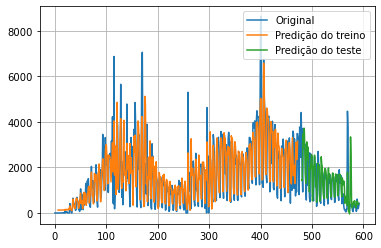

# Coneg-Panel-api
Panel-API for ConEg project

# Features

- Functions to list and retrieve each information from our fact table;
- Functions to sign in and list every person registered on system ConEg;
- Functions to configure the system's city and also [ConEg PaTra](https://github.com/marcosatsf/coneg-panel-user)
- API routes documentation available once this docker image is built. Use without moderation 😎👌;
- Timeseries prediction of new daily cases of Covid-19 from cities inside state of São Paulo:

## Caveat
As this project is directly related to [ConEg repo](https://github.com/marcosatsf/coneg-project), it's recommended run the whole project in order to see the expected result when this was built, this means, when detected a face with or no mask, a request is sent to an API project that will handle that event.
